# 数理统计及matlab统计工具箱使用

## 一、总体与样本

## 二、常见的统计量

 

1. 表示位置的统计量——平均值和中位数

   **平均值**（或均值，数学期望）：
   $$
   \bar{X}=\frac{1}{n} \sum_{i=1}^nX_i
   $$
   **中位数**：将数据由小到大排序后位于中间位置的那个数值.

2.  表示变异程度的统计量—标准差、方差和极差.

     **标准差**：它是各个数据与均值偏离程度的度量.
   $$
   s=[\frac{1}{n-1}\sum_{i=1}^n(X_i-\bar{X})^2]^{\frac{1}{2}}
   $$
   

   ​       

     **方差**：标准差的平方.

     **极差**：样本中最大值与最小值之差.

3.  表示分布形状的统计量—偏度和峰度

   **偏度**：偏度反映分布的对称性
   $$
   g_1=\frac{1}{s^3}\sum_{i=1}^n(X_i-\bar{X})^3
   $$
   $g_1 >0$称为右偏态，此时数据位于均值

   右边的比位于左边的多；

   $g_1 <0$称为左偏态，情况相反；

   而$g_1$接近0则可认为分布是对称的.

   **峰度**:峰度是分布形状的另一种度量，
   $$
   g_2=\frac{1}{s^4}\sum_{i=1}^n(X_i-\bar{X})^4
   $$
   

   正态分布的峰度为3，若$g_2$比3大很多，表示分布有沉重的尾巴，说明样本中含有较多远离均值的数据，因而峰度可用作衡量偏离正态分布的尺度之一.

   

4. **k阶原点矩：**
   $$
   V_k=\frac{1}{n}\sum_{i=1}^nX_i^k
   $$
   

   **k阶中心距**：
   $$
   U_k=\frac{1}{n}\sum_{i=1}^n(X_i-\bar{X})^k
   $$
   

## 三、分布函数的近似求法

1. **整理资料**： 把样本值$x_1，x_2，\cdots,x_n$进行分组，先将它们依大小次序排列，得$x_1^*\leq x_2^*\leq \cdots \leq x_n^* $.在包含$[x_1^*,x_n^*]$区间[*a*，*b*]内插入一些等分点：$a<x_1'<x_2'<\cdots<x_n'<b$，注意要是每一个区间$(x_i',x_{i+1}'](i=1,2,\cdots,n-1)$内都有样本观测值$x_i（i=1，2，…，n-1）$落入其中.

2. **求出各组的频数和频率**：统计出样本观测值在每个区间$$(x_i',x_{i+1}']$$中出现的次数$n_i$，它就是这区间或这组的频数.计算频率$f=\frac{n_i}{n}$。

3. **作频率直方图**：在直角坐标系的横轴上，标出$x_1',x_2',\cdots,x_n'$各点，分别以$$(x_i',x_{i+1}']$$为底边，作高为$\frac{f_i}{\Delta x_i}$的矩形，$\Delta x_i'=x_{i+1}'-x_i',i=1,2,\cdots,n-1$，即得频率直方图

   

## 四、四大分布

### 1.正态分布$N(\mu,\sigma)$

密度函数：
$$
p(x)=\frac{1}{\sqrt{2 \pi}\sigma}e^{\frac{(x-\mu)^2}{2\sigma^2}}
$$
分布函数：
$$
F(x)=\frac{1}{\sqrt{2 \pi}\sigma}\int_{-\infty} ^x e^{\frac{(y-\mu)^2}{2\sigma^2}}dy
$$

标准正态分布$N(0,1)$

密度函数：
$$
\varphi(x)=\frac{1}{\sqrt{2 \pi}}e^{-\frac{x^2}{2}}
$$
分布函数：
$$
F(x)=\frac{1}{\sqrt{2 \pi}}\int_{-\infty} ^x e^{\frac{y^2}{2}}dy
$$
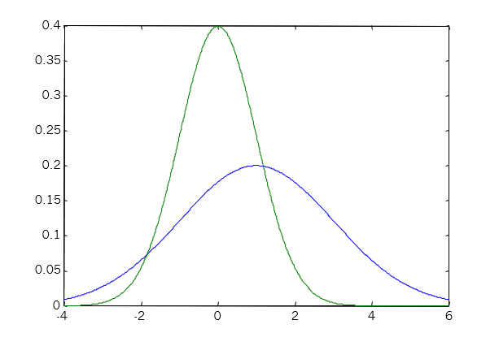

### 2.$\chi^2$分布$\chi^2(n)$

若随机变量$X_1,X_2,\cdots,X_n$相互独立，都服从标准正态分布$N(0,1)$，则随机变量
$$
Y=X_1^2+X_2^2+\cdots+X_n^2
$$
服从自由度为$n$的$\chi^2$分布，记为$$Y \sim \chi^2(n) $$分布.$Y$的均值为$n$，方差为$2n$。

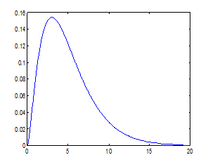

### 3.$t$分布$t(n)$

若$X \sim N(0,1)，Y \sim \chi^2(n)$，且相互独立则随机变量
$$
T=\frac{X}{\sqrt{\frac{Y}{n}}}
$$
服从自由度为$n$的$t$分布，记为$T\sim t(n)$。

$t(20)$分布的密度函数曲线和$N(0,1)$的曲线形状类似。

理论上$n \rightarrow \infty$时，$T \sim t(n) \rightarrow N(0,1)$.

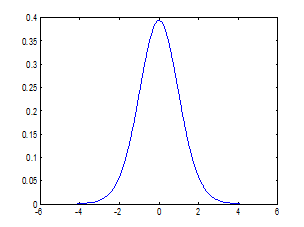

### **4.$F$分布$F(n_1,n_2)$**

若$X \sim \chi^2(n_1),Y\sim \chi^2(n_2)$，且相互独立，则随机变量
$$
F=\frac{\frac{X}{n_1}}{\frac{Y}{n_2}}
$$
服从自由度为$(n_1,n_2)$的$F$分布，记作$F \sim F(n_1.n_2)$.

由$F$分布的定义可以得到$F$分布的一个重要性质：
$$
若F \sim F(n_1,n_2),则\frac{1}{F}\sim F(n_2,n-1)
$$
$F(10,50)$分布的密度函数曲线

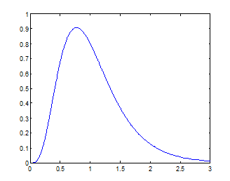

## 五、参数估计

无论总体$X$的分布函数$F(x;\theta_1,\theta_2,\cdots,\theta_k)$的类型已知或未知，我们总是需要去估计某些未知参数或数字特征，这就是参数估计问题。

参数估计就是从样本$(X_1,X_2,\cdots,X_n)$出发，构造一些统计量$\hat{\theta_i}(X_1,X_2,\cdots,X_n)(i=1,2,\cdots,k)$去估计总体$X$中的某些参数(或数字特征)$\theta_i(i=1,2,\cdots,k)$。这样的统计量称为**估计量**。

### 1.点估计

构造$(X_1,X_2,\cdots,X_n)$的函数$\hat{\theta_i}(X_1,X_2,\cdots,X_n)$作为参数$\theta_i$的点估计量，称统计量$\hat{\theta_i}$为总体$X$参数$\theta_i$的点估计量。

#### （一）矩估计法

假设总体分布中共含有$k$个参数，他们往往是一些原点矩或一些原点矩的函数，

例如，数学期望是一阶原点矩，方差是二阶原点矩与一阶原点矩平方之差等.

因此，要想估计总体的某些参数$\theta_i(i=1,2,\dots,k)$，由于$k$个参数一定可以表为不超过$k$阶原点矩的函数，

很自然就会想到用样本的$r$阶原点矩去估计总体的$r$阶原点矩，用样本的一些原点矩的函数去估计总体的相应的一些原点矩的函数，再将*k*个参数反解出来，

从而求出各个参数的估计值.这就是矩估计法，

它是最简单的一种参数估计法

#### （二）极大似然估计

若抽样的结果得到样本观测值$x_1,x_1,\cdots，x_n$，我们应当选取参数$\theta_i$的值，使这组样本观测值出现的结果的可能性最大，即构造似然函数：
$$
\begin{aligned}
L(\theta_1,\theta_2,\cdots,\theta_k)&=P(X_1=x_1,X_2=x_2,\cdots,X_n=x_n)\\
                          			&=P(X_1=x_1)P(X_2=x_2)\cdots P(X_n=x_n) \\
                          			&=p(x_1,\theta_1,\cdots,\theta_k)p(x_2,\theta_1,\cdots,\theta_k)\cdots p(p(x_n,\theta_1,\cdots,\theta_k)) \\
                          			&=\prod_{i=1}^np(x_i,\theta_1,\cdots,\theta_k)
\end{aligned}
$$
使$L(\theta_1,\cdots,\theta_k)$达到最大，从而得到参数$\theta_i$的估计值$\hat{\theta_i}$。此估计值称为**极大似然估计值**。函数$L(\theta_1,\cdots,\theta_k)$称为**似然函数**。

求极大似然估计值的问题，就是求似然函数$L(\theta_1,\cdots,\theta_k)$的最大值问题，则
$$
\frac{\partial L}{\partial \theta_i}=0 \ i=1,2,\dots,k \\
即 \frac{\partial ln L}{\partial \theta_i}=0 \ i=1,2,\dots,k
$$

#### （三）估计量的评价标准

**无偏性**

**一致性**

### 2.区间估计

构造两个函数$\theta_{i1}(X_1,X_2,\cdots,X_n),\theta_{i2}(X_1,X_2,\cdots,X_n)$，把$(\theta_{i1},\theta_{i2})$作为参数$\theta_i$的区间估计。

设总体$X$的分布中含有未知参数$\theta$，若对于给定的概率$1-\alpha\ \ (0<\alpha<1)$，存在两个统计量$\hat{\theta_1}(X_1,X_2,\cdots,X_n),\hat{\theta_2}(X_1,X_2,\cdots,X_n)$，使得
$$
P（\hat{\theta_1}<\theta<\hat{\theta_2}）=1-\alpha
$$
则称随机区间$(\theta_{i1},\theta_{i2}$为参数$\theta$的置信水平为$1-\alpha$的置信区间，$\theta_{i1}$称为**置信下限**，$\theta_{i2}$称为**置信上限**

#### (一)数学期望的置信区间

##### 1.已知$DX$，求$EX$的置信区间

##### 2.未知方差$DX$,求$EX$的置信区间

#### (二)方差的区间估计

## 六、假设检验

### 假设检验的一般步骤

1．根据实际问题提出原假设$H_0$与备择假设$H_1$，即说明需要检验的假设的具体内容；

2．选择适当的统计量，并在原假设$H_0$成立的条件下确定该统量的分布；

3．按问题的具体要求，选取适当的显著性水平$\alpha$,并根据统计量的分布查表,确定对应于$\alpha$的临界值.一般$\alpha$取0.05,0.01或0.10；

4．根据样本观测值计算统计量的观测值，并与临界值进行比较，从而在检验水平$\alpha$下对拒绝或接受原假设$ H_0$作出判断.

### 1.参数检验

如果观测的分布函数类型已知，这时构造出的  统计量依赖于总体的分布函数，这种检验称为参数检验. 参数检验的目的往往是对总体的参数及其有关性质作出明确的判断.

#### (一)单个正态总体均值的检验

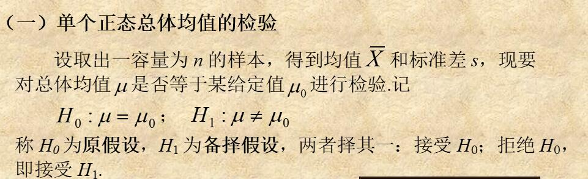

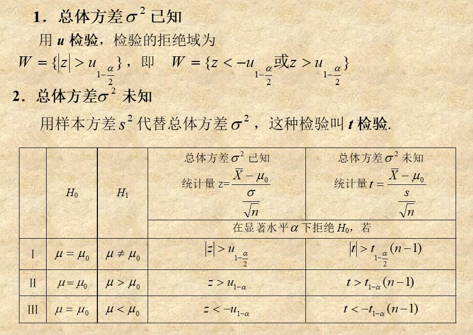

#### (二)单个正态总体方差的检验

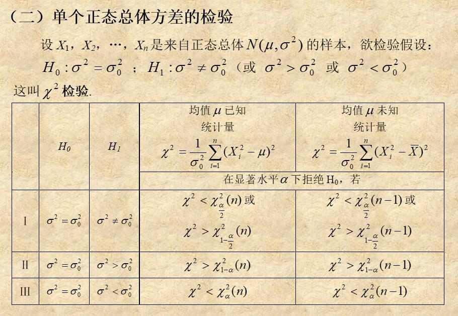

#### (三)两个正态总体均值的检验

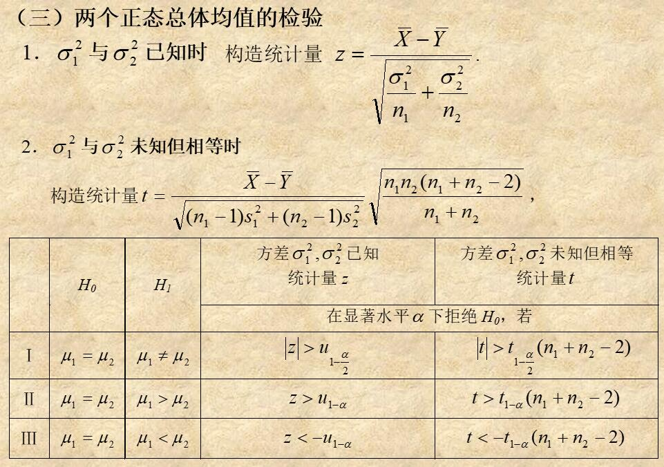

#### (四)两个正态总体方差的检验

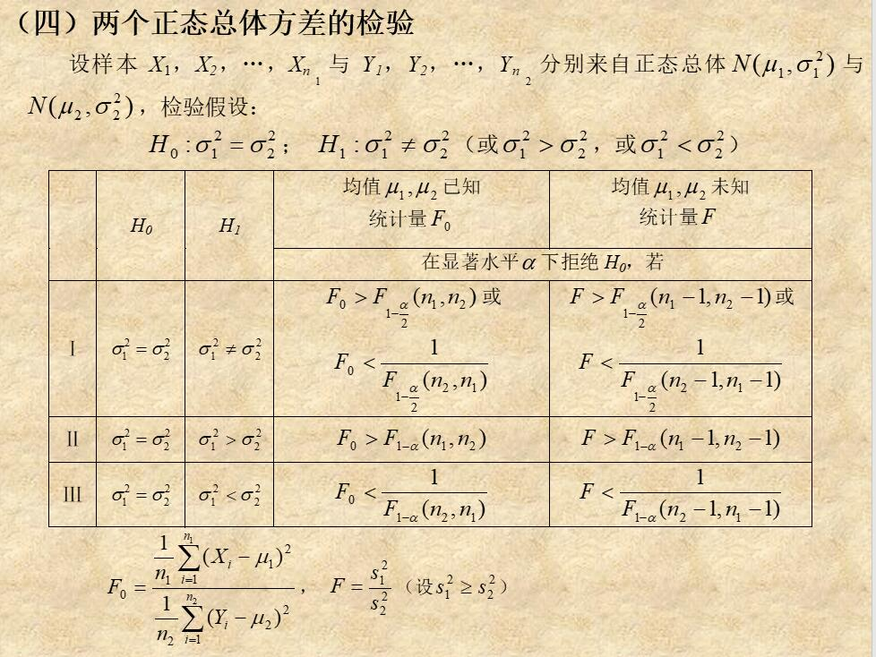

### 2.非参数检验

如果所检验的假设并非是对某个参数作出明确的判断，因而必须要求构造出的检验统计量的分布函数 不依赖于观测值的分布函数类型，这种检验叫非参数检验. 如：要求判断总体分布类型的检验就是非参数检验.

#### (一)皮尔逊$\chi^2$拟合检验法

#### (二)概率纸检测法

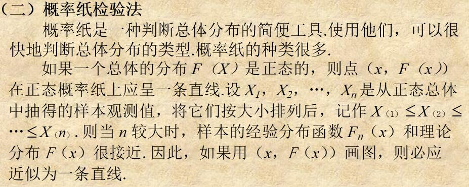

# matlab概率工具箱使用

## 1.加载数据

## 2.基本统计量

对随机变量**x**，计算其基本统计量的命令如下：

均值：**mean(x)**

中位数：**median(x)**

标准差：**std(x)**      

方差：**var(x)**

偏度：**skewness(x)**    

峰度：**kurtosis(x)**

## 3.常见概率分布的函数

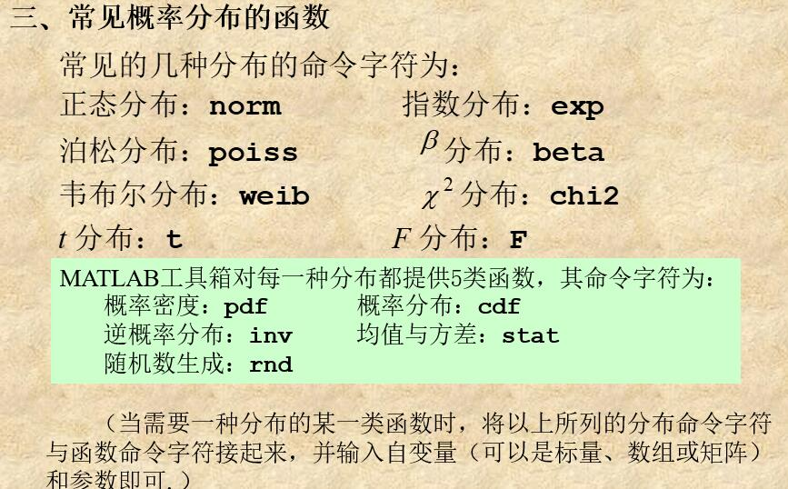

## 4.数直方图的描绘

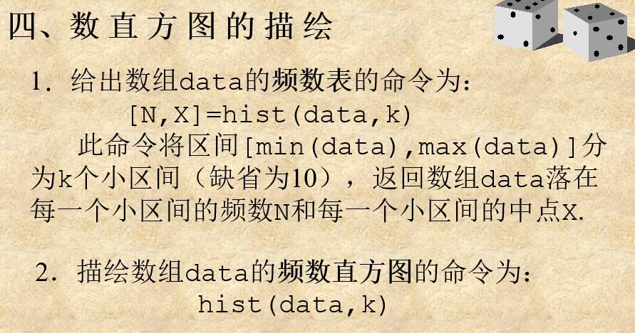

## 5.参数估计

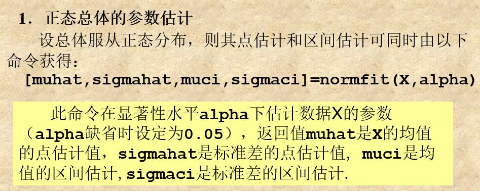

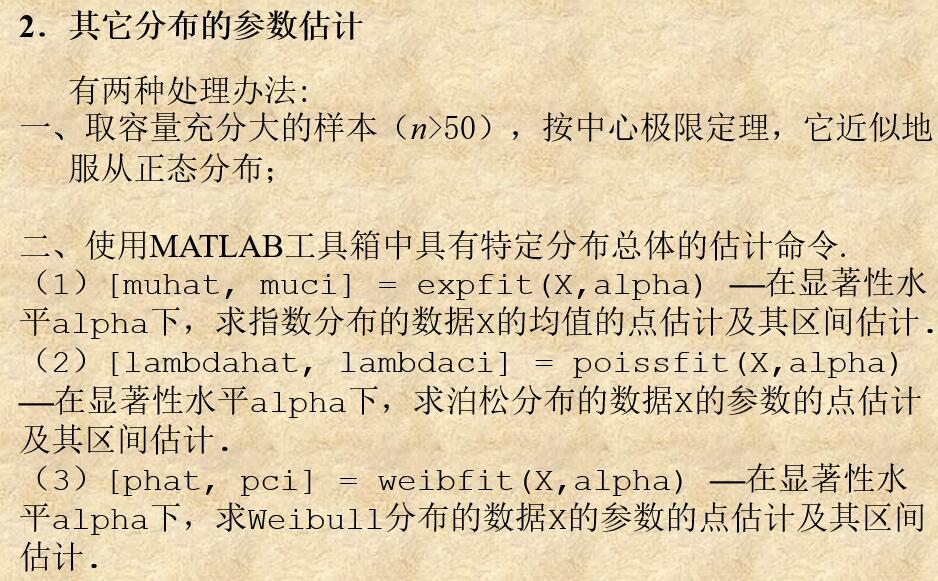

## 6.假设检验

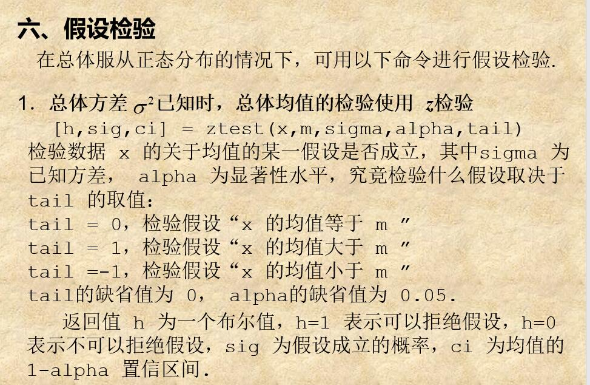

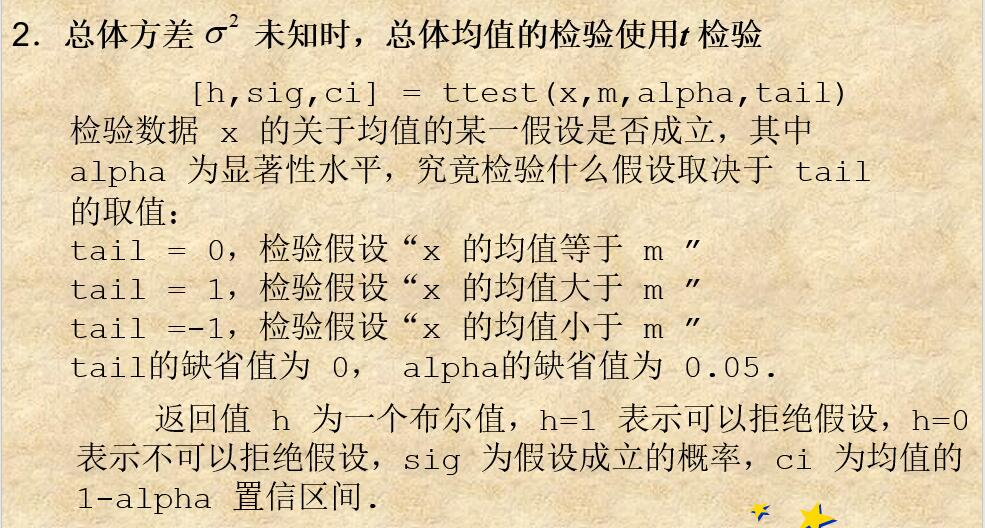

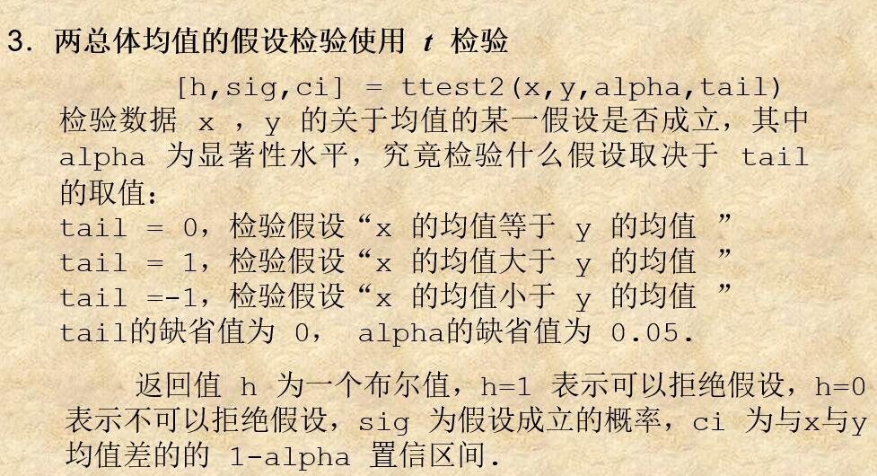

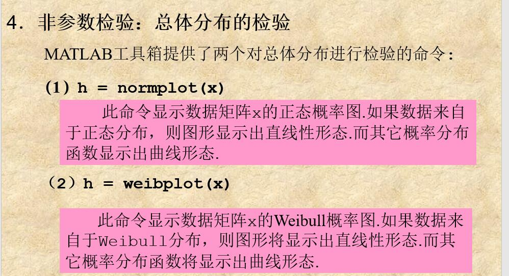

