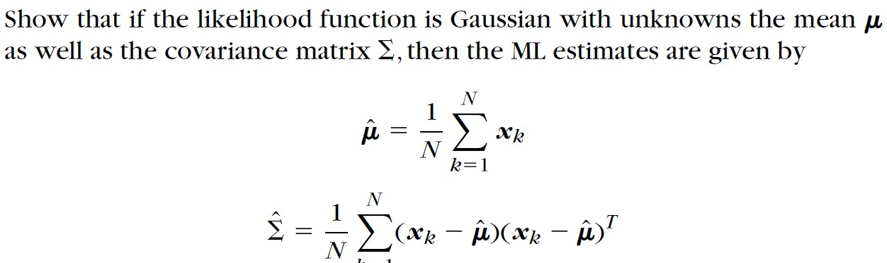
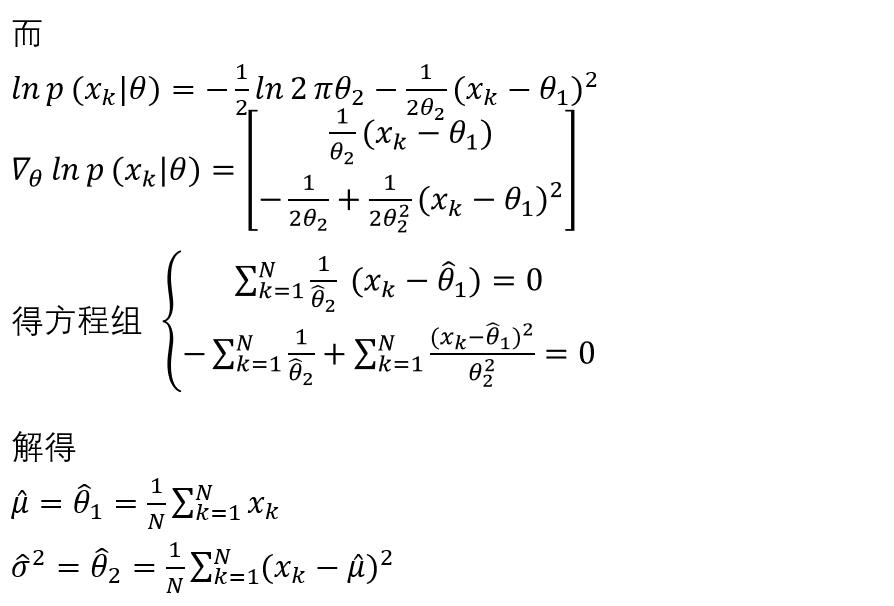

# 模式识别作业：

## 第一次 2.25

名词解释：

**1.模式识别**

Pattern Recognition)  用计算机实现人对各种事物或现象的分析,描述,判断,识别。

**2.有监督的模式识别，非监督的模式识别**

有监督的模式识别：supervised pattern recognition 已知要划分的类别，并且能够获得一定数量的类别已知的训练样本

非监督的模式识别：unsupervised pattern recognition 在面对一堆未知的对象时，我们自然要试图通过考察这些对象之间的相似性来将它们区分开来 。 

**3.模式识别的主要方法**

- 基于知识的方法 专家系统，句法模式识别
- 基于数据的模式识别方法 收集一定数量的已知样本，利用这些样本作为训练集来训练一定的模式识别机器，使之能对未知样本进行分类  
- 在类别标号y与特征向量x存在一定的未知依赖关系、但已知的信息只有一组训练数据对{(x,y)}的情况下，求解定义在x上的某一函数 ，对未知样本的类别进行预测。这一函数叫做分类器（classifier）。这种根据样本建立分类器的过程也称作学习过程或训练过程。

具体方法有，聚类分析，支持向量机，朴素贝叶斯分类，神经网络

## 第二次作业 2.28

**2.1 概率论中的先验概率、后验概率与概率密度函数是什么，如何理解Bayes公式。**

**先验概率**（a priori probability）：是在没有对样本进行任何观测的情况下的概率

**后验概率**(*a posteriori* probability or posterior)：是关于随机事件或者不确定性断言的条件概率，是在相关证据或者背景给定并纳入考虑之后的条件概率。后验概率分布就是未知量作为随机变量的概率分布，并且是在基于实验或者调查所获得的信息上的条件分布。后验概率是关于参数 θ 在给定的证据信息 X 下的概率，即 P(θ|X) 

**概率密度函数**： 是随机变量的分布

## 

**2.2假定在细胞识别中，病变细胞的先验概率和正常细胞的先验概率分别为$P(ω_1 )=0.05,P(ω_2 )=0.95$。现有一个待识别的细胞，其观察值为$x$,从类条件概率密度函数曲线上查$p(x|ω_1)=0.5, p(x|ω_2)=0.2$。试对细胞$x$进行分类。**

解：
$$
\begin{aligned}
已知P(ω_1 )&=0.05,P(ω_2 )=0.95，p(x|ω_1)=0.5, p(x|ω_2)=0.2 \\
P(w_1|x)&=\frac{P(x|w_1)*P(w_1)}{P(x|w_1)P(w_1)+P(x|w_2)P(w_2)} \\
&=\frac{0.5*0.05}{0.5*0.05+0.2*0.95} \\
&=0.116279\\
P(w_2|x)&=\frac{P(x|w_2)*P(w_2)}{P(x|w_1)P(w_1)+P(x|w_2)P(w_2)} \\
&=\frac{0.2*0.95}{0.5*0.05+0.2*0.95} \\
&=0.883721 \\
&P(w_1|x)<P(w_2|x) \ x \in w_2
细胞x是正常细胞

\end{aligned}
$$

## 第三次作业 3.3

 2.4假定在细胞识别中，病变细胞的先验概率和正常细胞的先验概率分别为$P(ω_1 )=0.05,P(ω_2 )=0.95$。现有一个待识别的细胞，其观察值为$x$,从类条件概率密度函数曲线上查$p(x|ω_1)=0.5, p(x|ω_2)=0.2$。,决策风险函数$λ_{11}=0，λ_{12}=12；λ_{21}=1，λ_{22}=0$。试按照最小风险Bayes 决策分类 
$$
\begin{aligned}
(1)计算后验概率 \\
已知P(ω_1 )&=0.05,P(ω_2 )=0.95，p(x|ω_1)=0.5, p(x|ω_2)=0.2 \\
P(w_1|x)&=\frac{P(x|w_1)*P(w_1)}{P(x|w_1)P(w_1)+P(x|w_2)P(w_2)} \\
&=\frac{0.5*0.05}{0.5*0.05+0.2*0.95} \\
&=0.116279\\
P(w_2|x)&=\frac{P(x|w_2)*P(w_2)}{P(x|w_1)P(w_1)+P(x|w_2)P(w_2)} \\
&=\frac{0.2*0.95}{0.5*0.05+0.2*0.95} \\
&=0.883721 \\
\end{aligned}
$$
   (2)计算风险

| 决    | 状    | 态    |
| ----- | ----- | ----- |
| 策    | $w_1$ | $w_2$ |
| $a_1$ | 0     | 12    |
| $a_2$ | 1     | 0     |

$$
\begin{aligned}
R(a_1|x)&=\sum_{j=1}^2\lambda_{1j}P(w_j|x) \\
&=0*0.116279+12*0.883721 \\
&=10.604652 \\
R(a_2|x)&=\sum_{j=1}^2\lambda_{2j}P(w_j|x) \\
&=1*0.116279+0*0.883721 \\
&=0.116279 \\

因为R(a_1|x)>R(a_2|x),采用决策a_2，即待识别细胞为正常细胞
\end{aligned}
$$

## 第四次 3.15

1. 概率密度函数估计的基本方法有哪两种？

   估计概率密度的两种方法

   1. 参数方法(parametric methods)

   2. 非参数方法(nonparametric methods)

2. 名词解释：参数估计，非参数估计；极大似然估计，MAP估计。

   **参数估计**： 

   ​		参数估计（parameter estimation），统计推断的一种。根据从总体中抽取的随机样本来估计总体分布中未知参数的过程。在参数估计中，对基本分布先要做出假定，只是其特征值需要估计 。从估计形式看，区分为点估计与区间估计：从构造估计量的方法讲，有矩法估计、最小二乘估计、似然估计、贝叶斯估计等。要处理两个问题：（1）求出未知参数的估计量；（2）在一定信度（可靠程度）下指出所求的估计量的精度。 

   **非参数估计**：

   ​		 非参数估计(nonparametric estimation)是相对于参数估计来说的一类估计方法。 在非参数估计中，对基本分布不做假定，主要利用随机抽样本身的信息来对估计量的优劣作出判断，最大得分估计量方法就是一种非参数估计方法；

   **极大似然估计：**

   一般说来，事件$A$发生的概率与某一未知参数$\theta$有关，$\theta$取值不同，则事件$A$发生的概率$P(A|\theta)$也不同，当我们在一次试验中事件$A$发生了，则认为此时的$\theta$值应是$t$的一切可能取值中使$P(A|\theta)$达到最大的那一个，极大似然估计法就是要选取这样的$t$值作为参数$t$的估计值，使所选取的样本在被选的总体中出现的可能性为最大.

   **MAP估计：**

    在贝叶斯统计学中，最大后验（Maximum A Posteriori，MAP）估计可以利用经验数据获得对未观测量的点态估计。它与Fisher的最大似然估计（Maximum Likelihood，ML）方法相近，不同的是它扩充了优化的目标函数，其中融合了预估计量的先验分布信息，所以最大后验估计可以看作是正则化（regularized）的最大似然估计。 

3. 

$$
\begin{aligned}
&以单变量Gaussian分布为例  \\
&\theta=[\theta_1,\theta_2],\theta_1=\mu ,\theta_2= \sigma^2 \ P(x|\theta)=\frac{1}{\sqrt{2\pi\sigma}}\exp[-\frac{1}{2}(\frac{x-\mu}{\sigma})^2] \\
&样本集 X=\{x_1.x_2,\cdots,x_N\} \\
&似然函数 L(x)=p(X|\theta)=\prod_{k=1}^NP(x_k|\theta) \\
&对数似然函数 H(\theta)=ln L(x) =\sum_{k=1}^Nln P(x_k|\theta) \\
&最大似然估计量满足方程 \nabla_\theta H(\theta)=\sum_{k=1}^N\nabla_\theta lnP(x_k|\theta)=0 \\

\end{aligned}
$$

