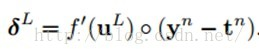

# 模式识别大作业

>学校名称 ： 南京工业大学 数理学院 信息与计算科学（嵌入式）17级
>
>课程名称 ： 模式识别
>
>实验名称 ： $BP$神经网络识别手写字母
>
>成员         ：  信科1702 	2010170220 	王立颖
>
>​					   信科1702 	2010170208 	郭浩天
>
>指导老师  ：  丁建中


[TOC]


# 一 字符图像的特征提取

## 1.数字字符的输入

### (1)  训练集和测试集素材的获取

数字字符可以手写图片然后扫描或拍照得到照片。训练集图片要有确定的输出，测试集也需要有正确结果与神经网络的预测结果进行比对，所以照片应该有明确的标签。可以通过照片的命名标注，也可以通过特定的排列进行标注。

老师要求识别手写数字，但是提供的数据集过小有可能出现过拟合的现象，我们从网上下载了包括a,d,m,n,p,q,r,u,w这9个字母共720张图片作为训练集，63张图片作为测试集。

### (2)  $matlab$读取数据

代码实现

```matlab
 %遍历文件夹读取每一张图片
 imgname = strcat('.\train\',int2str(i),'.bmp'); %读取图片名称
 img = imread(imgname);          %从 imagename 指定的文件读取图像 返回数组img
```

## 2.图像预处理

### (1)  图像的灰度化与二值化

使用自己扫描或者拍摄得到的图片需要进行二值化处理，我们使用的数据是从网上直接下载的二值图片不需要再进行二值化处理。下面对图片的灰度化和二值化进行介绍。

**RGB图像**

 我们所拍摄或得到的图片大多是具有RGB三个分量若干的像素点的图片。像素点是最小的图像单元，一张图片由好多的像素点构成。  RGB三个分量（R：Red，G：Green，B：Blue），即红、绿、蓝三原色来表示真彩色，R分量，G分量，B分量的取值范围均为0~255 。

 例如一张图片的尺寸是800 * 800 的，即宽度是800像素，高度是800像素。也就是说这张图片是由一个800 * 800的像素点矩阵构成 。因为一个像素点的颜色是由RGB三个值来表现的，所以一个像素点矩阵对应三个颜色向量矩阵，分别是R矩阵，G矩阵，B矩阵，它们也都是800 *800大小的矩阵 。

**图像的灰度化**

 图片的灰度化就是让像素点矩阵中的每一个像素点都满足下面的关系：R=G=B（就是红色变量的值，绿色变量的值，和蓝色变量的值，这三个值相等，“=”的意思不是程序语言中的赋值，是数学中的相等），此时的这个值叫做灰度值。  因此，灰度图像每个像素只需一个字节存放灰度值（又称强度值、亮度值），灰度范围为0-255。一般常用的是加权平均法来获取每个像素点的灰度值。 

常用方法：

- 平均值法 ： `（R + G + B）/ 3`

- 最大最小值法 ： `(Max(R,G,B) + Min(R,G,B)) / 2`

- 权重法：`0.299 * R + 0.587 * G + 0.144 * B`

代码实现：

~~~matlab
rgb2gray()
~~~

**图像的二值化**

 图像的二值化，就是将图像上的像素点的灰度值设置为0或255，也就是将整个图像呈现出明显的只有黑和白的视觉效果 

常用方法：

- 基于平均值
- 经验值 127

代码实现

~~~matlab
 %将灰度图像f转换为二值图像imgbw
 level = graythresh(f);   %使用graythresh自动获取阈值（0-1）计算灰度门槛
 imgbw = im2bw(f,level);  %二值化的方法
 
 %将RGB图像转换为二值图像
 imgbw = im2bw(RGB, level)
%当输入图像不是灰度图像时，im2bw先将图像转换为灰度图像，再将图像通过灰度门槛level转换为二值图像
~~~

### (2) 图片的裁剪

读取二值化后的图片可以得到一个$0-1$矩阵，不妨先将背景设置为$1$，手写字母字迹设置为$0$.

方法：找到手写字母的边界进行裁剪。

代码实现：

~~~matlab
bw=x;	%x为读取的图片
[i,j]=find(bw==0);
imin=min(i);
imax=max(i);
jmin=min(j);
jmax=max(j);
bw1=bw(imin:imax,jmin:jmax);  %将原图像进行剪切，删掉空白信息的部分 注意 0为目标区域，1位背景颜色
~~~

### (3) 图片的压缩 和 大小统一化 

将图片压缩为$16*16$的矩阵。得到的结果为背景设置为$0$，手写字母字迹设置为$1$的$16*16$的矩阵。

代码实现

~~~matlab
rate=16/max(size(bw1));       %确定压缩比率  保证长或高为16，确定压缩比率
bw1=imresize(bw1,rate);       %返回图像bw1，它是将 bw1 的长宽大小缩放 rate 倍之后的图像。输入图像 A 可以是灰度、RGB 或二值图像
[i,j]=size(bw1);              %缩放后的矩阵（图像）大小

i1=round((16-i)/2);
j1=round((16-j)/2);
p1(i1+1:i1+i,j1+1:j1+j)=bw1;  %补全剩余部分

p1=-1.*p1+ones(16,16);  %调整图像为16*16的二值矩阵 此时1为字母笔迹，0为背景颜色

~~~

## 3.特征提取

对压缩后的图片提取特征点并对训练集进行标签标注。由于我们对图片进行了二值化和裁剪压缩并对图片的大小进行了同一，可以直接把从图片得到的$16*16$矩阵作为特征点使用。

代码实现

~~~matlab
	img = imgresize(img);          		   %图像  裁剪压缩为16*16 的矩阵
    feature = double(reshape(img,1,256));   %将特征点重新排列为 1*256 的数组
    feature = feature/max(feature);         %
    input(i,:) = feature;                   %将每一个图片的特征数组保存为一行 
    %标签的标注
    y = ceil(i/80);                			%由于训练集中数据80个为1组
    output(i,y)=1;                          %记录图片对应的数字 训练集对应的标签
~~~


# 二 BP神经网络的设计

## 1. $BP$ 神经网络原理浅析

### (1) $BP$ 神经网络简介

$BP$神经网络是怎样的一种定义？看这句话：一种按“误差逆传播算法训练”的多层前馈网络。

$BP$的思想就是：利用输出后的误差来估计输出层前一层的误差，再用这层误差来估计更前一层误差，如此获取所有各层误差估计。这里的误差估计可以理解为某种偏导数，我们就是根据这种偏导数来调整各层的连接权值，再用调整后的连接权值重新计算输出误差。直到输出的误差达到符合的要求或者迭代次数溢出设定值。

$BP$的传播对象就是“误差”，传播目的就是得到所有层的估计误差。

它的学习规则是：使用最速下降法，通过反向传播（就是一层一层往前传）不断调整网络的权值和阈值，最后使全局误差系数最小。

它的学习本质就是：对各连接权值的动态调整。

前馈网络由使用$DOTPROD$权重函数、$NETSUM$网络输入函数和指定传递函数的$NL$层组成。


​															图1   $BP$网络拓扑结构

拓扑结构如上图：输入层（input），隐藏层（hide layer），输出层（output）

$BP$网络的优势就是能学习和储存大量的输入输出的关系，而不用事先指出这种数学关系。


$BP$利用处处可导的激活函数来描述该层输入与该层输出的关系，常用S型函数δ来当作激活函数。

### (2) $BP$ 神经网络算法

有监督的$BP$神经网络学习算法：

1、正向传播得到输出层误差$e$

=>输入层输入样本=>各隐藏层=>输出层

2、判断是否反向传播

=>若输出层误差与期望不符=>反向传播

3、误差反向传播

=>误差在各层显示=>修正各层单元的权值，直到误差减少到可接受程度。

### (3) $BP$ 神经网络的数学推导

**具体的计算方法**

 假设我们的网络结构是一个含有N个神经元的输入层，含有P个神经元的隐层，含有Q个神经元的输出层。


 这些变量分别如下：


认识好以上变量后，开始计算：

**一**、用$（-1，1）$内的随机数初始化误差函数，并设定精度$ε$，最多迭代次数$M$

**二**、随机选取第$k$个输入样本及对应的期望输出


重复以下步骤至误差达到要求：

三、计算隐含层各神经元的输入和输出


四、计算误差函数$e$对输出层各神经元的偏导数，根据输出层期望输出和实际输出以及输出层输入等参数计算。


五、计算误差函数对隐藏层各神经元的偏导数，根据后一层（这里即输出层）的灵敏度（稍后介绍灵敏度）$δo(k)$，后一层连接权值$w$，以及该层的输入值等参数计算


六、利用第四步中的偏导数来修正输出层连接权值


七、利用第五步中的偏导数来修正隐藏层连接权值


八、计算全局误差（m个样本，q个类别）


比较具体的计算方法介绍好了，接下来用比较简洁的数学公式来大致地概括这个过程，相信看完上述的详细步骤都会有些了解和领悟

**大致地概括**

 假设我们的神经网络是这样的，此时有两个隐藏层 


每一个隐藏层第l层的灵敏度为：


这里的“◦”表示每个元素相乘，不懂的可与上面详细公式对比理解

而输出层的灵敏度计算方法不同，为：



而最后的修正权值为灵敏度乘以该层的输入值，注意了，这里的输入可是未曾乘以权值的输入，即上图的$X_i$级别。


对于每一个权值$(W)_{ij}$都有一个特定的学习率$η_{Ij}$，由算法学习完成


## 2.$matlab$ 详解 newff​ (前馈反向传播网络)


### (1) newff 函数参数说明

```matlab
net = newff(P,T,S)                             % 这两种定义都可以
net = newff(P,T,S,TF,BTF,BLF,PF,IPF,OPF,DDF)
```

　>$P$：输入参数矩阵。$(R * Q_1)$，其中$Q_1$代表$R$元的输入向量。其数据意义是矩阵$P$有$Q_1$列，每一列都是一个样本，而每个样本有$R$个属性（特征）。一般矩阵$P$需要归一化，即$P$的每一行都归一化到$[0 1]$或者$[-1 1]$。 

$T$：目标参数矩阵。$(SN*Q_2)$，$Q_2$代表$SN$元的目标向量。 

$S$：$N-1$个隐含层的数目$（S（i）$到$S（N-1））$，默认为空矩阵$[ ]$。输出层的单元数目$SN$取决于$T$。返回$N$层的前馈$BP$神经网络 

$TF$：相关层的传递函数，默认隐含层为$tansig$ 函数，输出层为$purelin$函数。 

$BTF$：$BP$神经网络学习训练函数，默认值为$trainlm$函数。 　　$BLF$：权重学习函数，默认值为$learngdm$。 

$PF$：性能函数，默认值为$mse$，可选择的还有$sse$，$sae$，$mae$，$crossentropy$。 

$IPF$，$OPF$，$DDF$均为默认值即可。 

例子：
```
net = newff( input,output, [50] , { 'logsig' 'purelin' } , 'traingdx' ) ; 
```


### (2) 传递函数 $TF$

$purelin$： 线性传递函数。 
　　$tansig $：正切$S$型传递函数。 
　　$logsig$ ：对数$S$型传递函数。　 
　　隐含层和输出层函数的选择对$BP$神经网预测精度有较大影响，一般隐含层节点转移函数选用$ tansig$函数或$logsig$函数，输出层节点转移函数选用$tansig$函数或$purelin$函数。 

### (3) 学习训练函数 $BTF $

$traingd$：最速下降$BP$算法。 
　　$traingdm$：动量$BP$算法。 
　　$trainda$：学习率可变的最速下降$BP$算法。 
　　$traindx$：学习率可变的动量$BP$算法。 
　　$trainrp$：弹性算法。 
　　变梯度算法： 
　　　　$traincgf（Fletcher-Reeves修正算法） $
　　　　$ traincgp（Polak_Ribiere修正算法） $
　　	　$　 traincgb（Powell-Beale复位算法） $
　　　　$ trainbfg（BFGS 拟牛顿算法） $
　　　　$ trainoss（OSS算法）$


## 3.设计结果


​											图2 		设计得到的$BP$网络结构

### (1)输入神经元的个数

输入神经元的个数和输入学习样本所承担的特征点的数量有关 ，输入神将元为256个

### (2)输出层神经元的个数

输出神经元的个数和输出学习结果有关 ，由于识别结果是1-9 9个数字，所以输出神经元为9 

### (3)隐层神经元个数

具有两个隐含层，神经元数分别为30,9    

隐含层为$logsig$:   对数$S$型传递函数，

输出层为$purelin$ 线性传递函数

### (4)激活函数的确定

 $BP$利用处处可导的激活函数来描述该层输入与该层输出的关系，常用$S$型函数$δ$来当作激活函数 


# 三 $BP$神经网络的训练

## 1.训练参数的设置

~~~matlab
% net.divideFcn 属性，其值为'dividerand'。该函数把样本数据三分为训练集、验证集和测试集，默认比例是6:2:2
net.trainParam.goal=0.1               % 训练目标最小误差，这里设置为0.1
net.trainParam.epochs=300;            % 训练次数，这里设置为300次
net.trainParam.show=20;               % 显示频率，这里设置为没训练20次显示一次
net.trainParam.mc=0.95;               % 附加动量因子
net.trainParam.lr=0.05;               % 学习速率，这里设置为0.05
net.trainParam.min_grad=1e-6;         %最小性能梯度
net.trainParam.min_fail=5;            % 最大确认失败次数

~~~

## 2.开始训练

~~~matlab
% 开始训练  
net=train(net,input,output);   %开始训练   
save('net','net');				%保存训练好的网络
~~~


## 3.训练结果


​										 图3		训练结果

### （1）Neural Network 

　这里显示的是输入大小，中间层数量以及每层的神经元个数。

### （2）Algorithms 


　　	Training：trainged。这表示学习训练函数为最速下降$BP$算法。
　　	Performance：Mean Squared Error。这表示性能用均方误差来表示。 
　　	Calculations： MEX。

### （3）Progress 

　Epoch：迭代次数。  20000次
　　	Time：运行时间。 01:04
　　	Performance：训练数据集的性能。  0.292
　	　Gradient：梯度。 0.00463
　　	Validation Checks：最大验证失败次数。（解释：比如默认是6，则系统判断这个验证集误差是否在连续6次检验后不下降，如果不下降或者甚至上升，说明training set训练的误差已经不再减小，没有更好的效果了，这时再训练就没必要了，就停止训练，不然可能陷入过拟合。）

### （4）Plots 

　Performance：这里可以点进去，看train， validation和test的性能。 
　　	Training State：记录Gradient和Validation Checks。 
　　	Regression：通过绘制回归线来测量神经网络对应数据的拟合程度。


​																图4   Training Performance


​																 图5    Training State


​																图6    Training Regression


# 四 $BP$神经网络的识别

使用训练好的神经网络对测试集进行预测，并计算准确率。

## 1.测试集数据的读取和标签标注

训练集图片的读取和标签标注与测试集处理相同，此处不再赘述。

## 2.使用神经网络对测试集进行预测

代码实现

~~~matlab
%使用神经网络对测试集进行预测
Y = sim(net,testInput);
[val,index] = max(Y);
~~~

## 3.测试集的预测结果


​																图7   测试集的预测结果

## 4.准确率的统计与计算

统计预测结果的准确率并计算

代码实现

~~~matlab
%统计每张图片的预测结果
%计算各个数字的单项正确率 ，总体正确率
acc = 0;  %统计预测正确的结果
for i=1:63
    if index(i)==ceil(i/7)
        acc = acc+1;
    end
end

%总体准确率
accuracy = acc/63;
%单项准确率
result=[index(1:7);index(8:14);index(15:21);index(22:28);index(29:35);
    index(36:42);index(43:49);index(50:56);index(57:63)];
for i=1:9
ac(i)=0;
end
for i=1:9
    for j=1:7
    if result(i,j)==ceil(((i-1)*7+j)/7)
        ac(i) = ac(i)+1;
    end
    end
     ac(i) = ac(i)/7;
end
%输出结果
disp(strcat('识别结果: ',num2str(result)))
disp(strcat('单项正确率: ',num2str(ac)))
disp(strcat('正确率: ',num2str(accuracy)))
~~~


# 五 参考文献

1. 《matlab，详解神经网络训练中的nntraintool窗口》

   版权声明：本文为CSDN博主「xiaotao_1」的原创文章，遵循CC 4.0 BY-SA版权协议，转载请附上原文出处链接及本声明。原文链接：https://blog.csdn.net/xiaotao_1/article/details/79089316

2. 《matlab详解newff(前馈反向传播网络)	》

   版权声明：本文为CSDN博主「xiaotao_1」的原创文章，遵循CC 4.0 BY-SA版权协议，转载请附上原文出处链接及本声明。
   原文链接：https://blog.csdn.net/xiaotao_1/article/details/79078729

3. 《深入浅出BP神经网络算法的原理》
   版权声明：本文为CSDN博主「fa分三十三」的原创文章，遵循CC 4.0 BY-SA版权协议，转载请附上原文出处链接及本声明。
   原文链接：https://blog.csdn.net/qq_45252766/article/details/93368651

