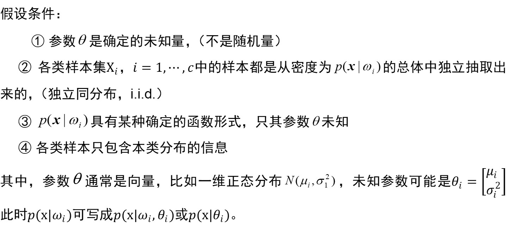
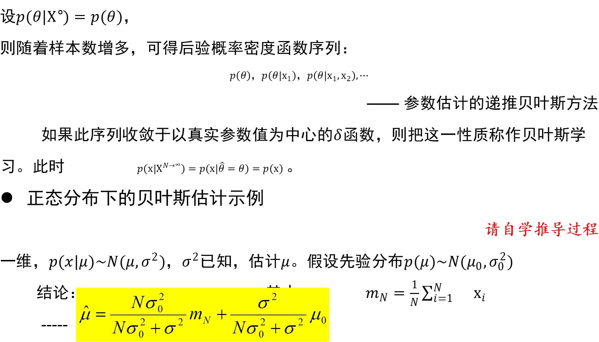
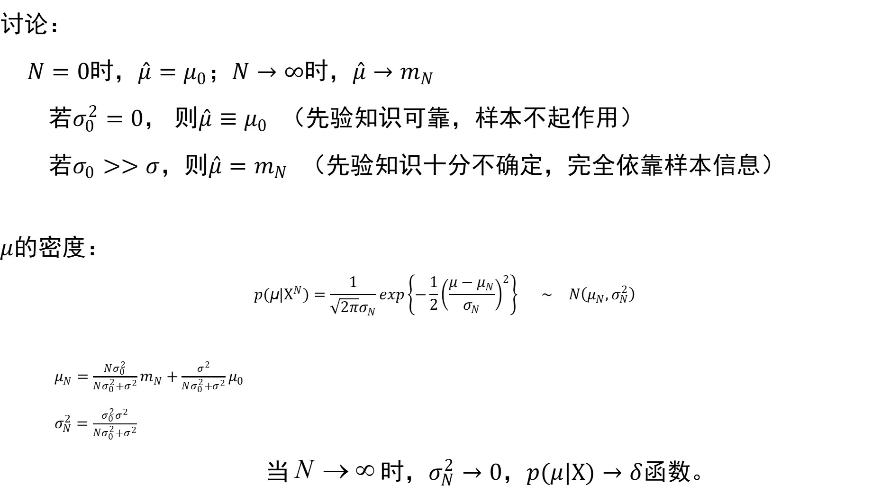
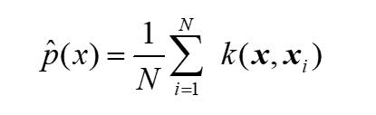
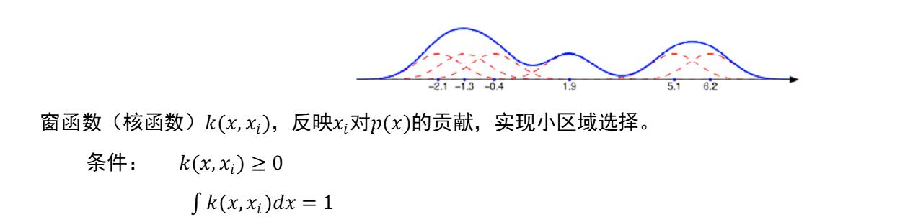
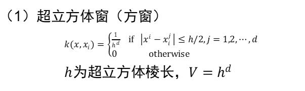
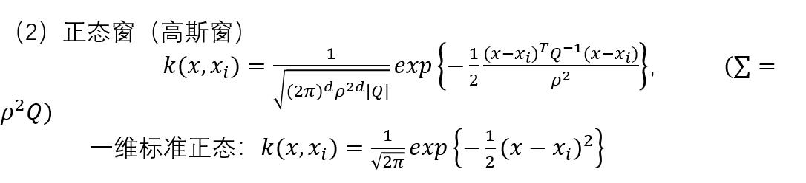
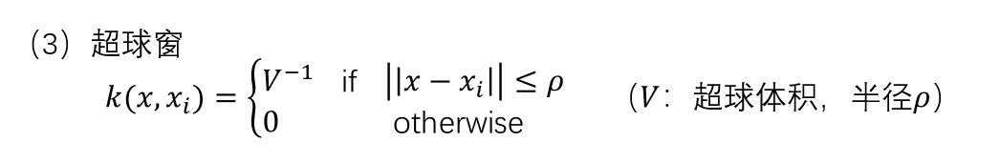

#      第三章概率密度函数的估计  

如何用样本集估计概率密度函数

估计概率密度的两种方法

1. 参数方法(parametric methods)

2. 非参数方法(nonparametric methods)

   

本章要求估计总体分布的具体参数，是个点估计问题：最大似然估计和贝叶斯估计

判断估计好坏标准：无偏性，有效性及一致性

## 一 概率密度估计的参数方法

## 3.2最大似然估计

### 假设条件：

若抽样的结果得到样本观测值$x_1,x_1,\cdots，x_n$，我们应当选取参数$\theta_i$的值，使这组样本观测值出现的结果的可能性最大，即构造似然函数：
$$
\begin{aligned}
L(\theta_1,\theta_2,\cdots,\theta_k)&=P(X_1=x_1,X_2=x_2,\cdots,X_n=x_n)\\
                          			&=P(X_1=x_1)P(X_2=x_2)\cdots P(X_n=x_n) \\
                          			&=p(x_1,\theta_1,\cdots,\theta_k)p(x_2,\theta_1,\cdots,\theta_k)\cdots p(p(x_n,\theta_1,\cdots,\theta_k)) \\
                          			&=\prod_{i=1}^np(x_i,\theta_1,\cdots,\theta_k)
\end{aligned}
$$
使$L(\theta_1,\cdots,\theta_k)$达到最大，从而得到参数$\theta_i$的估计值$\hat{\theta_i}$。此估计值称为**极大似然估计值**。函数$L(\theta_1,\cdots,\theta_k)$称为**似然函数**。

求极大似然估计值的问题，就是求似然函数$L(\theta_1,\cdots,\theta_k)$的最大值问题，则
$$
\frac{\partial L}{\partial \theta_i}=0 \ i=1,2,\dots,k \\
即 \frac{\partial ln L}{\partial \theta_i}=0 \ i=1,2,\dots,k
$$

#### 

## 3.3 贝叶斯估计和贝叶斯学习

**贝叶斯估计**

思路与贝叶斯决策类似，只是离散的决策状态变成了连续的估计。

**基本思想：**

把待估计参数$θ$看作具有先验分布$p(θ)$的随机变量，其取值与样本集X有关，根据样本集$X={x_1,x_2,⋯,x_N }$估计$θ$。

**损失函数**：

 				把$θ$估计为$θ$   所造成的损失，记为$λ(θ ̂,θ)$

**期望风险**：
$$
\begin{aligned}
R=& \int_{E^d} \int_\Theta \lambda(\hat{\theta},\theta)p(x,\theta)d\theta dx \\
=&\int_{E^d} \int_\Theta \lambda(\hat{\theta},\theta)p(\theta|x)p(x)d\theta dx \\
=&\int_{E^d}R(\hat{\theta},\theta)p(x)dx \\
其中 x \in E^d ,\theta \in \Theta

\end{aligned}
$$

**条件风险**：
$$
R(\hat{\theta},\theta)=\int_\theta \lambda(\hat{\theta},\theta)p(\theta|x)d\theta
$$

最小化期望风险   $  \Rightarrow  
  $ 最小化条件风险  （对所有可能的x）

有限样本集下，最小化经验风险：
$$
R(\hat{\theta},\theta)=\int_\theta \lambda(\hat{\theta},\theta)p(\theta|x)d\theta
$$
**贝叶斯估计量：**（在样本集$X$下）使条件风险（经验风险）最小的估计量$θ$ 

#### ***定理3.1**　                        

如果采用平方误差损失函数，则$θ$的贝叶斯估计量$\hat{\theta}$是在给定$x$时$θ$的条件期望，即 
$$
\hat{\theta}=E[\theta|x]=\int_\Theta\theta p(\theta|x)d\theta
$$
同理可得到，在给定样本集$X$下，$θ$的贝叶斯估计是：
$$
\hat{\theta}=E[\theta|X]=\int_\Theta\theta p(\theta|X)d\theta
$$

### **求贝叶斯估计的方法：**（平方误差损失下）

1. 确定$θ$的先验分布$ p(θ)$

2. 求样本集的联合分布
   $$
   p(X|\theta)=\prod_{i=1}^Np(x_i|\theta)
   $$
   
3. 求$θ$的后验概率分布 
   $$
   p(\theta|X)=\frac{p(X|\theta)p(\theta)}{\int_\Theta\theta p(x|\theta )p(\theta)d\theta}
   $$
   
4. 求$θ$的贝叶斯估计量 
   $$
   \hat{\theta}=\int_\Theta\theta p(\theta|X)d\theta
   $$
   

  我们也可直接推断总体分布
$$
p(x|X)=\int_\Theta p(x|\theta) \  p(\theta|X)d\theta \\
其中 p(\theta|X)=\frac{p(X|\theta)p(\theta)}{\int_\Theta\theta p(x|\theta )p(\theta)d\theta}
$$

### 最大似然估计和贝叶斯估计的比较

设θ的最大似然估计为$\hat{\theta}_l$，则在$\theta=\hat{\theta}_l$处$p(θ|X)$很可能有一尖峰，若如此，且先验概率$p(θ)$在处非零且$\hat{\theta}_l$在附近变化不大，则
$$
p(x|X)\doteq p(x|\hat{\theta_l})
$$
即贝叶斯估计结果与最大似然估计结果近似相等。

如p(θ|X)的峰值不尖锐，则不能用最大似然估计来代替贝叶斯估计。

### 递推贝叶斯方法

考虑估计的收敛性：记学习样本个数$N$，样本集$X={x_1,x_2,⋯,x_N }$

$N>1时有     p(X^N |θ)=p(x_N |θ)p(X^{N-1} |θ)$

因此有递推后验概率公式：
$$
p(θ|X^N)=\frac{p(x_N |θ)p(θ|X^{N-1})}{\int p(x_N|\theta)p(θ|X^{N-1})d\theta}
$$

## 二 概率密度估计的非参数方法

## 3.4 直方图方法

非参数概率密度的估计的最简单方法

1. 把$x$的每个分量分成$k$个等间隔小窗，$若x \in E^d,则形成k^d个小舱$
2. 统计落入各个小舱内的样本数$q_i$
3. 相应小舱的概率密度为$q_i/(NV)（N：样本总数，V：小舱体积）$  

## 3.5 非参数估计的基本原理

问题：已知样本集$X={x_1,⋯,x_N }$，其中样本均从服从$p(x)$的总体中独立抽取，求估计$\hat{p}(x)，近似p(x)$。

考虑随机向量$x$落入区域的$\mathfrak{R}$概率$ P_R=\int_\mathfrak{R} p(x)dx$

$X$中有$k$个样本落入区域$\mathfrak{R}$的概率$P_k=C_N^k P_\mathfrak{R}^k (1-P_R )^{N-k}$

​		$k$的期望值 $E[k]=NP_R$

​		$k$的众数（概率最大的取值）为 $m=[(N+1)P_R]$

​		$P_R$的估计 $\hat{R}_R=\frac{k}{N}（k：实际落到\mathfrak{R}中的样本数）$

设$p(x)$连续，且$\mathfrak{R}$足够小，$\mathfrak{R}$的体积为$V$，则有
$$
P_R=\int_R p(x)dx=p(x)V x\in \mathfrak{R}
$$
因此
$$
\hat{p}(x)=\frac{k}{NV} \\
N：样本总数，\\
V： 包含x的一个小区域的体积 \\
k：落在此区域中的样本数 \\
\hat{p}(x)为对p(x)在小区域内的平均值的估计。
$$
**$V$的选择**  过大，估计粗糙；过小，可能某些区域中无样本

### 理论结果

.jpg)

### 两种选择策略

1. 选择$V_n$，（比如$V_n=\frac{1}{\sqrt{n}}$），同时对$k_n$和$\frac{k_n}{n}$加以限制保证收敛

   Parzen窗法

2. 选择$k_n$（比如$k_n=\sqrt{n}$），$V_n$正好包含$x$的$k_n$个近邻

   $K_N$近邻估计

   

#### Parzen窗法

##### 常用的窗函数：

1.超立方体窗（方窗）

2.正态窗（高斯窗）

3.超球窗

**窗宽的选择**	样本数少则选大些，样本数多则选小些，比如选$ρ=N^{-η/d}η∈(0,1)$

##### Parzen窗估计的性质

在满足一定的条件下，估计量$\hat{p}_N (x)$是渐近无偏和平方误差一致的。

条件是：

1. 总体密度$p(x)$在$x$点连续；

2. 窗函数满足以下条件：
   $$
   \begin{aligned}
   &𝜙(𝑢)≥0,   ∫𝜙(𝑢)𝑑𝑢=1        ：窗函数具有密度函数的性质\\
   &\sup_𝑢 𝜙(𝑢)<∞                 ：窗函数有界\\
   &\lim_{‖𝑢‖→∞} 𝜙(𝑢)∏_{𝑖=1}^𝑑 𝑢_𝑖 =0            ：窗函数随着距离的增大很快趋于零\\
   \end{aligned}
   $$
   

3. 窗宽受以下条件约束：
   $$
   
   \lim_{𝑁→∞} 𝑉_𝑁=0           ：窗体积随着N的增大而趋于零\\
   \lim_{𝑁→∞}𝑁𝑉_𝑁=∞         ：但体积减小的速度要低于1/N
   $$
   

