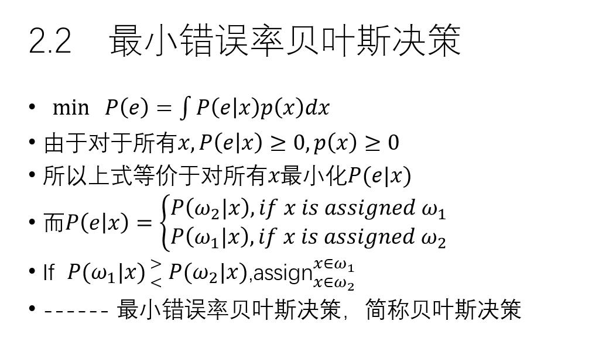
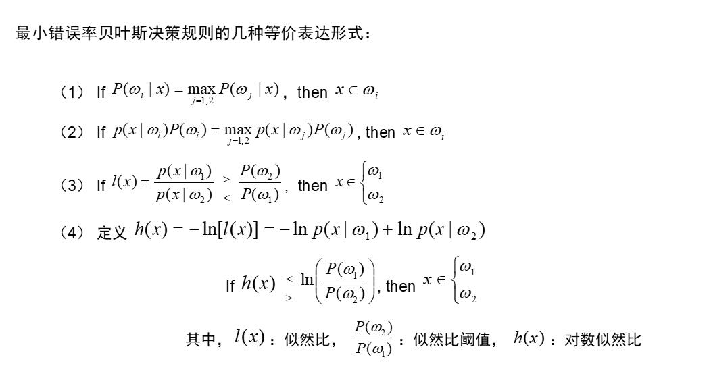
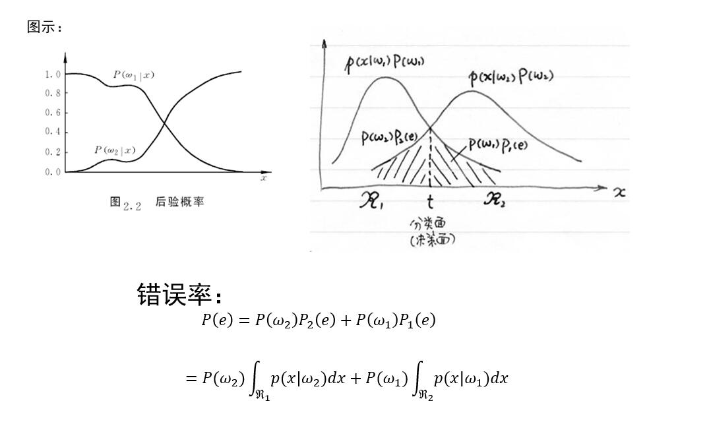
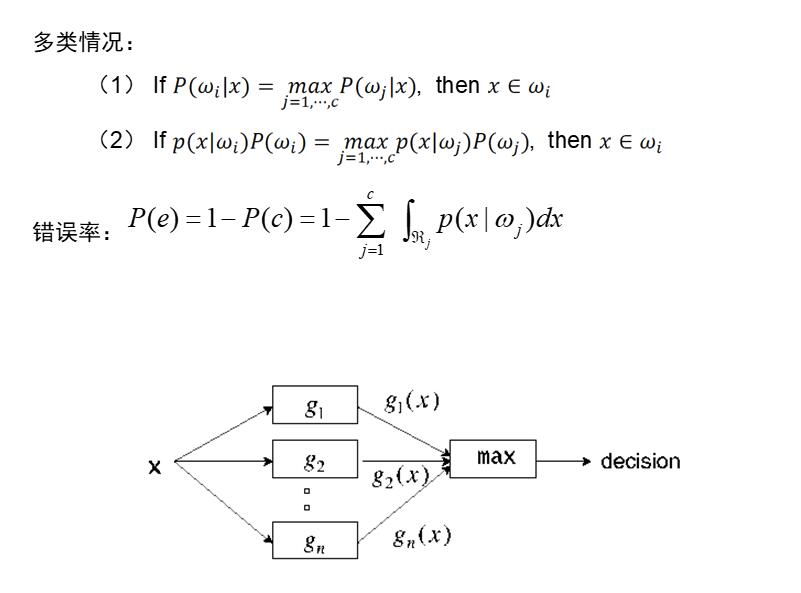
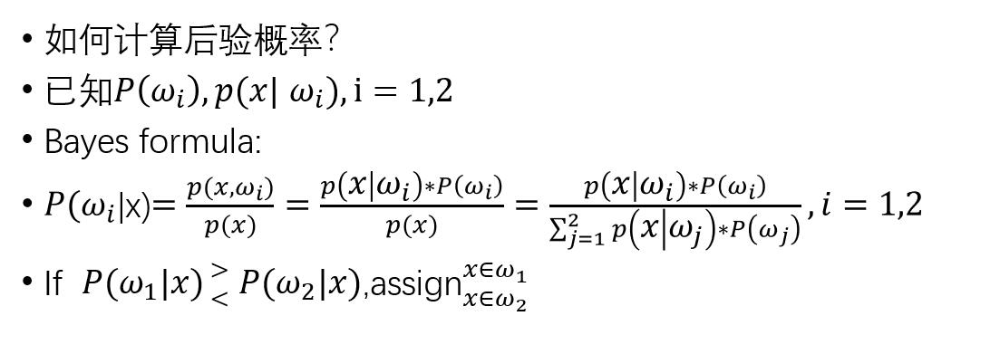
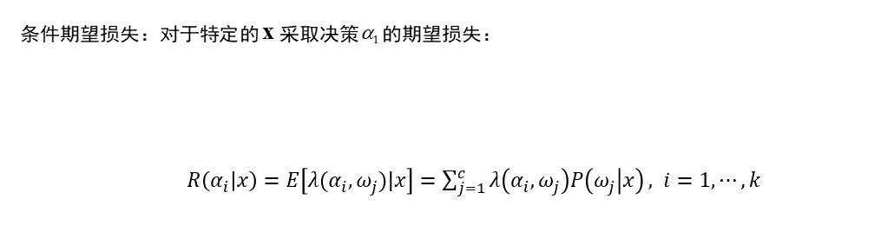
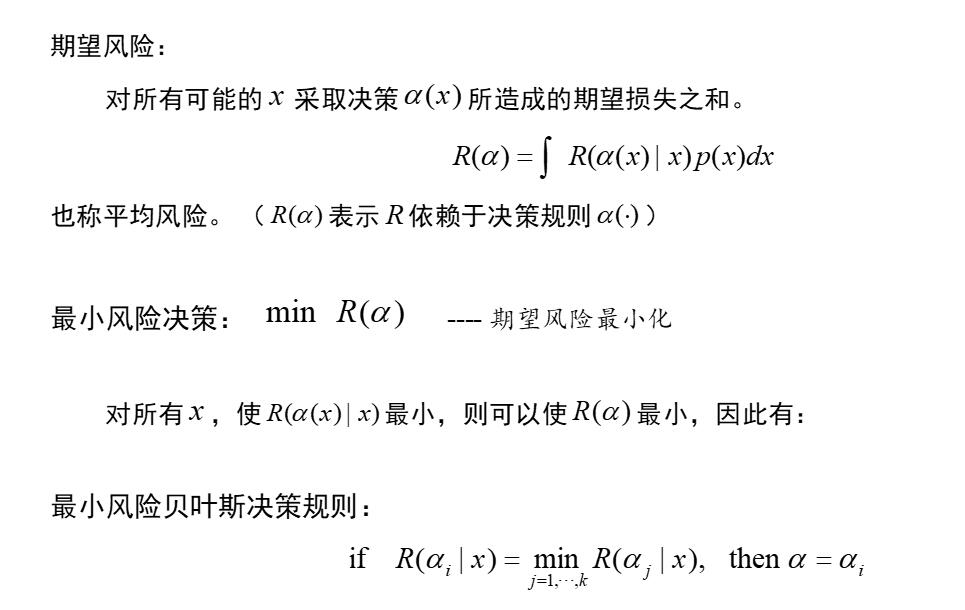
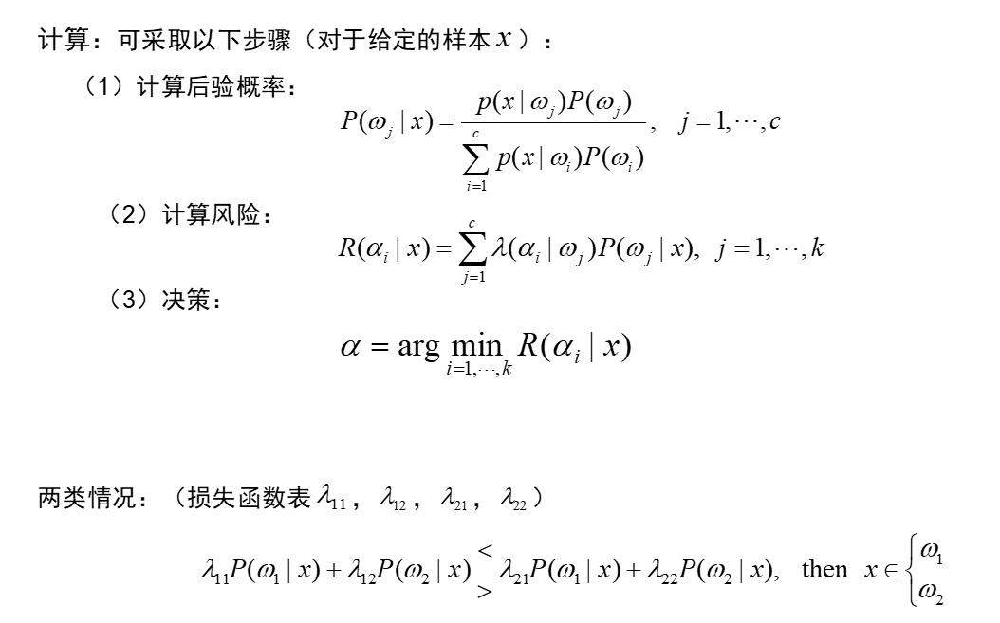
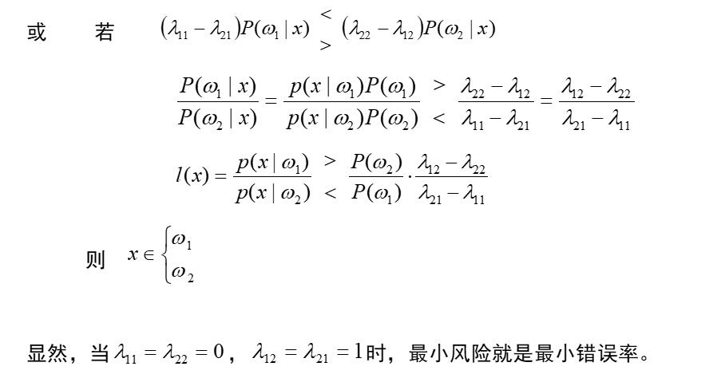
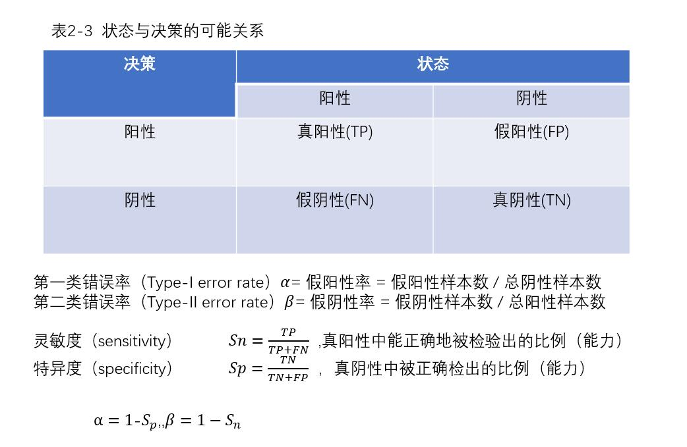

#      第二章 统计决策方法  

## 1 约定

•统计模式识别：用概率统计的观点和方法来解决模式识别问题

**基本概念：**

-  样本(sample)   $x \in R^d$

- 状态(state)

     第一类：$ω=ω_1 $， 

     第二类：$ω=ω_2$       

- 先验概率 (a priori probability or prior):

   是在没有对样本进行任何观测的情况下的概率

   $P(w_1),P(w_2)$   

-  样本分布密度(sample distribution density) : 

  $p(x) $（总体概率密度）  

- 类条件概率密度(class-conditional probability density) : 

  $p(x│ω_i )$

- 后验概率(*a posteriori* probability or posterior) : 

  是关于随机事件或者不确定性断言的条件概率，是在相关证据或者背景给定并纳入考虑之后的条件概率。后验概率分布就是未知量作为随机变量的概率分布，并且是在基于实验或者调查所获得的信息上的条件分布。后验概率是关于参数 θ 在给定的证据信息 X 下的概率，即 P(θ|X) 

  $P(ω_1|x),P(ω_2|x)$

- 错误概率(probability of error) :
  $$
  P(e|x)=  \begin{cases}
  P(ω_2 |x), &if \  x\  is \  assigned \ ω_1 \\
  P(ω_1 |x),  &if \ x\ is \ assigned\  ω_2 
  
  \end {cases}
  $$

- 平均错误率(average probability of error): 

  $P(e)=∫P(e│x)p(x)dx$

- 正确率(probability of correctness):

  $P(c)=1-P(e)$

- 贝叶斯决策（统计决策理论）是统计模式识别的基本方法和基础。是“最优分类器”：使平均错误率最小

  **条件：**

  1. 类别数一定，$ ω_i,i=1,2,…,c$（决策论中把类别称作状态）
  2. 已知类先验概率和类条件概率密度 : $P(ω_i), p(x│ω_i ), i=1,2,…,c$

  

  

## 2 最小错误率贝叶斯决策

### Bayes formula:

$$
\begin{aligned}
&如果\bigcup_{i=1}^nA_i=\Omega,A_iA_j=\emptyset(i\neq j,i,j=1,2,\cdots,n),P(A_i)>0,\\
&则对任一事件B，只要P(B)>0,就有 \\
&P(A_j|B)=\frac{P(A_j)P(B|A_j)}{\sum_{i=1}^nP(A_i)P(B|A_i)} (j=1,2,\cdots,n)
\end{aligned}
$$

## 3 最小风险贝叶斯决策

**计算**

## 两类错误

## 4 Neyman-Pearson决策

