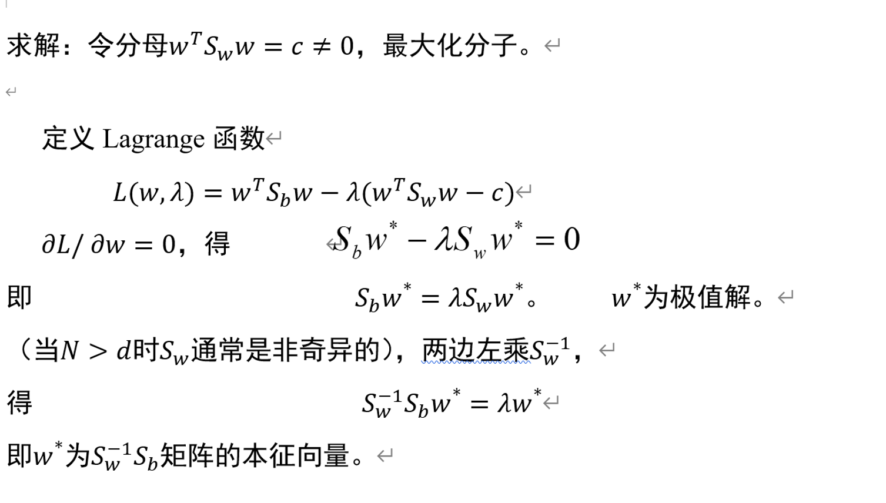
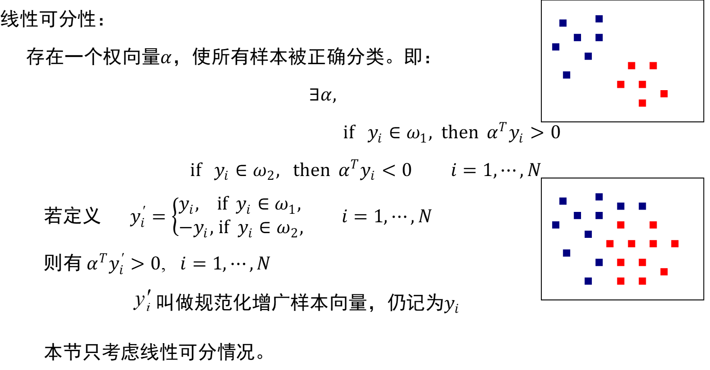

#      第四章 线性判别函数（线性分类器）  

## 4.1 引言

从基于概率密度（估计）的分类器设计 ( model-based method)到基于样本的直接分类器设计

思路： 首先选定判别函数类和一定的目标（准则），利用样本集确定出函数类中的某些未知参数，使所选的准则最好。

形式化： 
$$
判别函数类{g(α),α∈Λ} ， α：未定参数 \\
准则函数L(α) \\
求α^∗：L(α^∗)=\min_α L(α)
$$
本章只考虑线性判别函数$ g(x)=w^T x+w_0$

多类情况$ g_i (x)=w_i^T x+w_i0，i=1,⋯,c$   —— 次优分类器（相对于贝叶斯分类器）当正态分布且各类协方差相同时可为最优分类器

## 4.2一些基本概念

**权向量**

**阈值**

## 4.3　Fisher线性判别 Fisher Discriminant Analysis (FDA)  

## 4.4 感知器    ( Perceptron )

## 4.5 最小平方误差（MSE）准则函数

